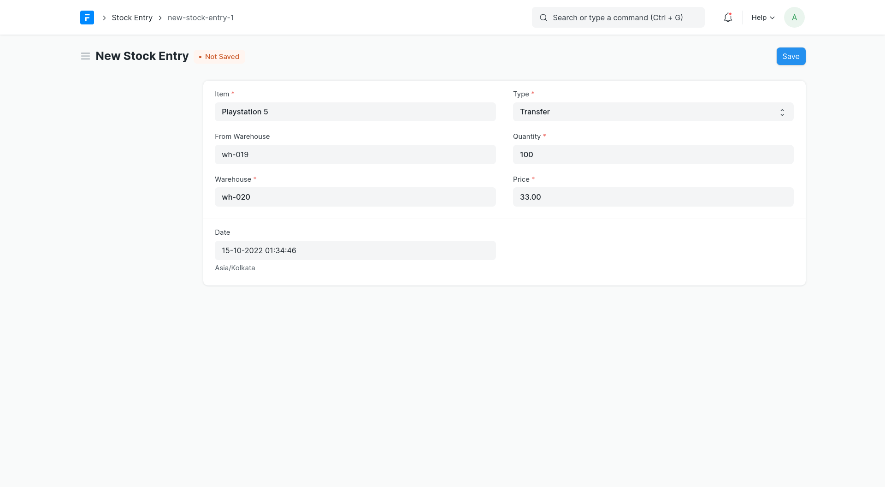
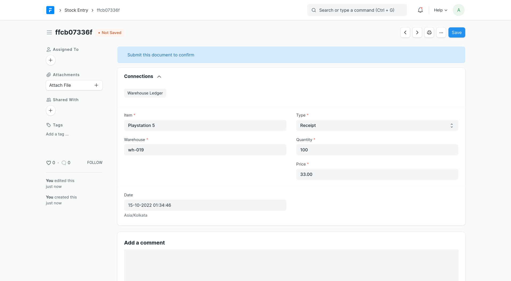
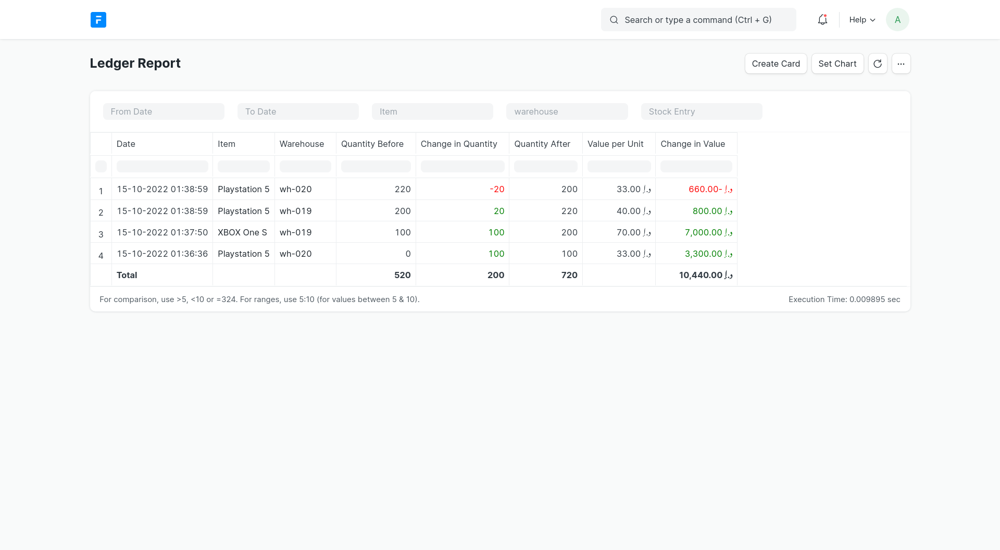
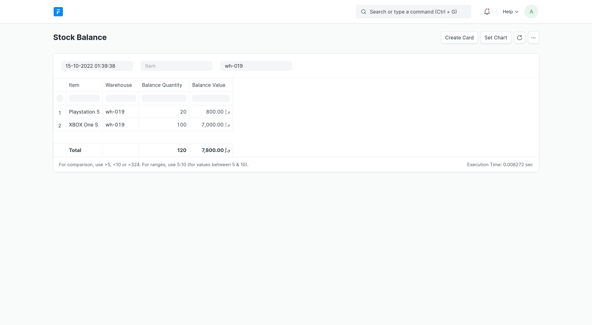
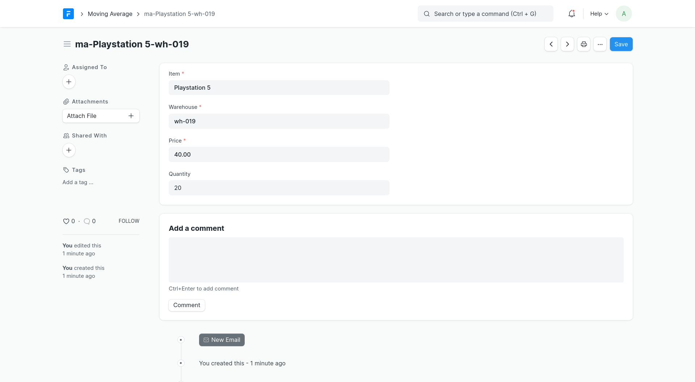

## Warehouse Management

### DocTypes
- Item
- Warehouse
- Stock Entry
- Moving Average
- Warehouse ledger

### Usage
- Add an `Item` and `Warehouse`
- Add a `Stock Entry` with
    - `Item`
    - `Warehouse`
    - `Type` could be either of
        - `Receipt`
        - `Consume`
        - `Transfer`
    - `From Warehouse` only if `Type` is `Transfer`
    - `Quantity`
    - `Price` only if `Type` is `Receipt` or `Transfer`
- Check `Ledger Report` and `Stock Balance Report`

### Screenshots
> 
> 
> 
> 
> 

